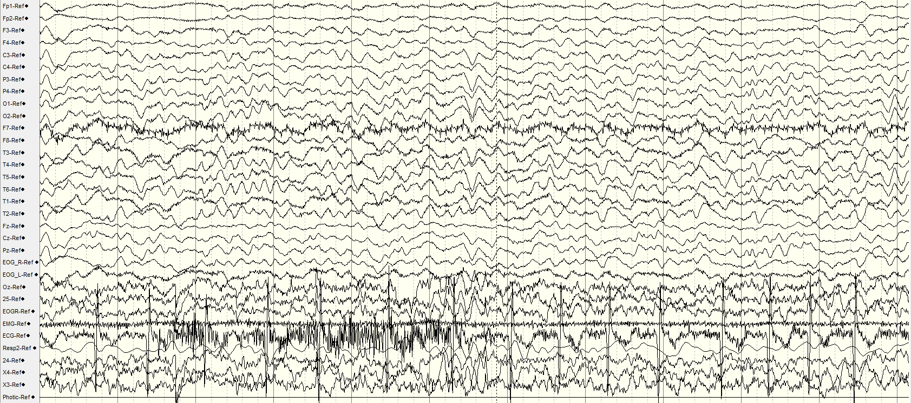

# Generative Diffusion Model For Epileptic EEG Spike Detection With Data Augmentation
<p align="center">
   
</p>

* This repository consist of code for implementation in "Generative Diffusion Model For Epileptic EEG Spike Detection With Data Augmentation"

## Abstract
Epilepsy diagnosis relies significantly on Electroencephalogram (EEG) analysis, particularly the detection of interictal epileptiform discharges (IEDs), such as spikes. By detecting spikes, seizures can be predicted based on spike counts and epileptogenic focus in preoperative assessments can be identified by source imaging using interictal spikes. Manual identification of these discharges is time-intensive. Despite existing automated methods, clinical adoption remains limited due to suboptimal performance by the classifiers built for detecting the spike. This paper presents a novel approach to enhance the automatic detection of epileptic spikes in EEG data using a classifier-free guidance diffusion model. By utilizing the WaveGrad architecture, a diffusion model architecture developed in the speech domain, the diffusion classifier achieves an impressive accuracy of 0.9908 and an F1-score of 0.9811 in classifying epileptic spikes. Besides, the study demonstrated performance improvements on deep learning classifiers in detecting spikes by training on the augmented data from diffusion model. Additionally, this study proposes a preprocessing technique to enhance the model’s focus while retaining the most useful information. 

## Working directories

```
   |---0_EEG_file_analysis.ipynb
   |---0_Pre-process_EEG_FILE.ipynb
   |---1_Visualize_EEG_Signal.ipynb
   |---2_Training_Diffusion_Model.ipynb
   |---3_Training_Classifiers.ipynb
   |---3_Training_Diffusion_Classifiers.ipynb
   |---4_Evaluate_Diffusion_Model.ipynb
   |---5_Training_Classifiers_with_synthesized_data.ipynb
   |---6_Label_EEG_data.ipynb

   |---model.py        # Contain the Neural Network implementation in pytorch
   |---settings.py     # All the settings
   |---utility.py      # Utility function
   |---ummc_db_util.py # Contain utility function to process .eeg file collected from UM
   
   |---EEG_Dataset
       |---patient1.eeg
       |---patient2.eeg
       ...
       |---patientn.eeg
   |---EEG_csv # Auto generated after running 0_Pre-process_EDF_FILE.ipynb
       |---eeg1.csv
       |---eeg2.csv
       ...
       |---eeg20.csv
       |---annotation.json
```

## Way to run the code
1. Install all the dependency library in your python environment. 

    ```pip install -r requirements.txt```
> *Make sure you have pytorch installed in your environment, if no, you can refer to [Pytorch Website](https://pytorch.org/get-started/locally/)* 

2. Place your EEG data in '.eeg' format into the 'EEG_dataset' directory

3. Analyze your EEG data using 0_EEG_file_analysis.ipynb

4. Adjust the settings in 'settings.py' based on your EEG data's properties

5. Preprocess the EDF file into csv file, the EEG_csv folder is auto generated

6. Visualize your EEG data before and after preprocess. Repeat from step 4 if the visualization does not meet your expectation

7. Train and evaluate the diffusion model and classifiers by consequently running the jupyter notebook file '2_Training_Diffusion_Model.ipynb', '3_Training_Classifiers.ipynb', ...
